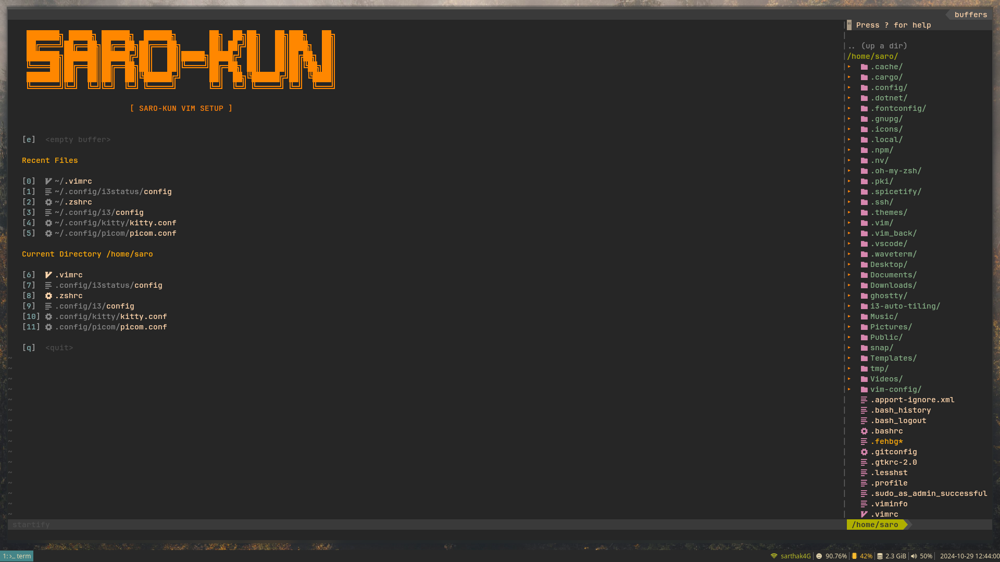

# Vim Configuration



This is a basic Vim configuration file designed for editing standard files efficiently. It comes with essential settings and plugins to enhance your editing experience. 

## Features

- Syntax highlighting
- File type detection
- Line numbers and cursor line highlighting
- Enhanced searching and case sensitivity
- Various plugin integrations for improved functionality

## Installation

1. **Clone the repository**:
   ```bash
   git clone https://github.com/codiwithsarthak/vim-config.git
   ```

2. **Cd into the repo**:
   ```bash
   cd vim-config
   ```

3. **Moving the files and folders** 
   ```bash
   mv plugged ~/.vim
   mv autoload ~/.vim
   mv .vimrc ~
   ```

4. **Install [Vim-Plug](https://github.com/junegunn/vim-plug)** if you haven’t already.

5. **Open Vim and install the plugins**:
   ```vim
   :PlugInstall
   ```

## Plugins Included

- `ale` for linting
- `nerdtree` for file navigation
- `gruvbox` for color scheme
- `fzf` for fuzzy file finding
- `coc.nvim` for code completion
- And many more for improved editing and navigation.

## Usage

This configuration is specifically tailored for editing basic files, making it simple yet effective. Launch Vim, and you'll find everything set up for a smooth editing workflow.

Feel free to customize this configuration further to suit your personal needs!

## License

This project is licensed under the MIT License. See the [LICENSE](LICENSE) file for details.
